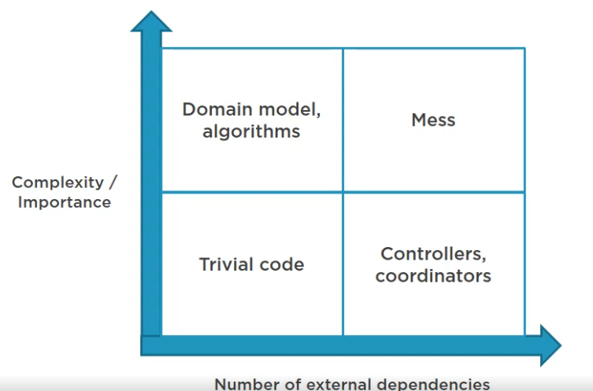

### Application/Unit Test Code Analysis

Unit tests:
- Collaboration verification inside the domain model
- Tests are coupled to implementation details

Code base:
- header interfaces
- cyclic dependencies
- lack of domain model isolation

The application has a lot of 1:1 interfaces which is a code smell. Having an interface does not automatically translate into an abstraction.

[Interfaces are not abstractions - Mark Seemann](https://bit.ly/interfaces-are-not)
>Interface is just a language construct. In essence, it's just a shape.

There are many ways an interface can turn out to be a poor abstraction.
- Violating the LSP (Liskov Substitution Principle) e.g. interface consumer needs to downcast an instance to properply work with it.
- Header interfaces - tend to state the same thing twice without apparent benefit.
- Shallow interfaces - tightly coupled depedency to concrete types exposed by members
- Leaky abstraction - implementation details becoming exposed or 'leaking' through the abstraction, forcing users to have knowledge of these underlying complexities to effectively use or troubleshoot the system

[Cyclic dependencies are evil](https://bit.ly/cyclic-dep)
Cyclic dependencies have no clear beginning or ending and adds cognitive load when you don't know where to start. On a top-down architecture a cyclic dependency from bottom layer to the top layer breaks the ordering and infact any of the layers between the cyclic dependency could be the top layer, and thus forming a one big single layer.

#### Domain Model Isolation

[xUnit Patterns - Humble Object](https://bit.ly/cyclic-dep)

The more important or complex the code is, the fewer external dependencies it should have.

The mess quadrant is the most problematic and covering unit tests are hard to implement and maintain. One should try to refactor the code into Domain and Controllers quadrants in order to implement proper tests.