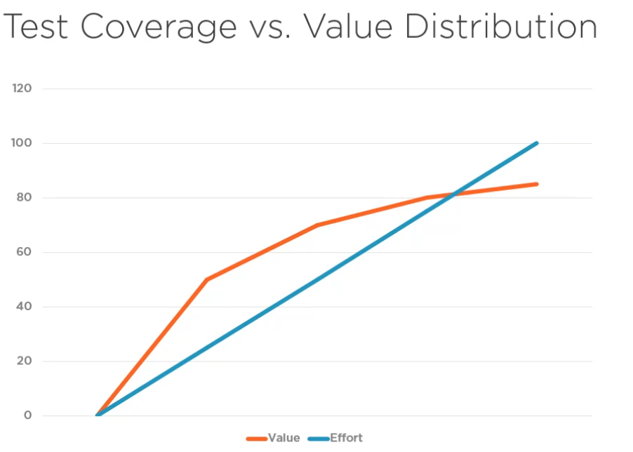
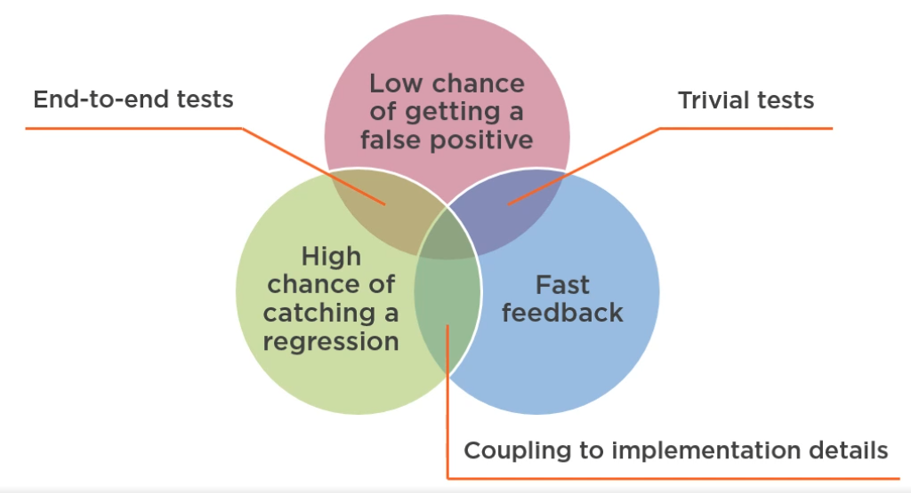

### Goals of unit testing
*Confidence*
- changes don't break esisting functionality
- accelerated development
- reduced techinal debt, due to lower refactoring threshold

### Coverage Metrics
The coverage metrics is a good indicator of a trend, but is hardly a measure of effectiveness.

$$
Code Coverage = LinesCodeCovered/TotalCodeLines
$$
This means that by altering your code to oneliners can give higher metrics but no increased quality.

$$
BranchCoverage = BranchesTraversed/TotalBranches
$$

Good negative indicator - If coverage numbers are low, your aren't testing your code base significantly enough.
Bad positive indicator - If coverage numbers are high, it doesn't mean anything.

As a rule of thumb spend the most time on testing business logic.

### What Makes a Test Valuable?
1. high chance of catching a regression error
- The more code is executed, the higher the chance
2. low chance of producing a false positive
- confidence to the tests is compromised
- decouple tests from implementation details
3. fast feedback
4. low maintenance cost

End-to-end tests

`+` provide best protection against regressions.

`+` are immune to false positives

`-` slow feedback

