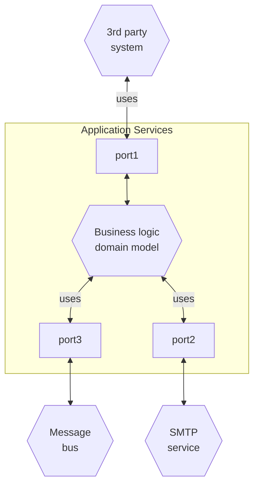
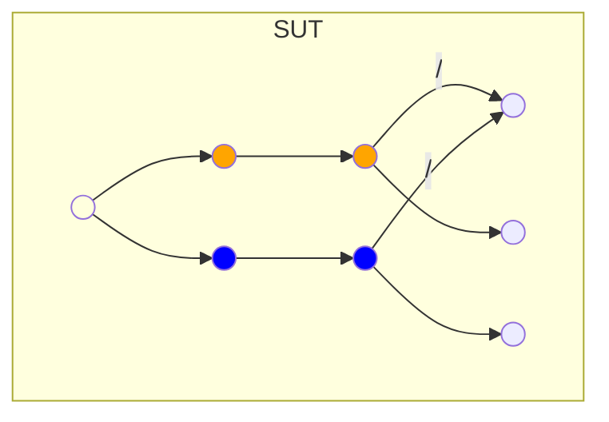
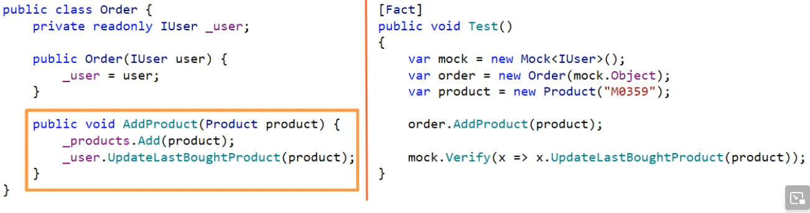
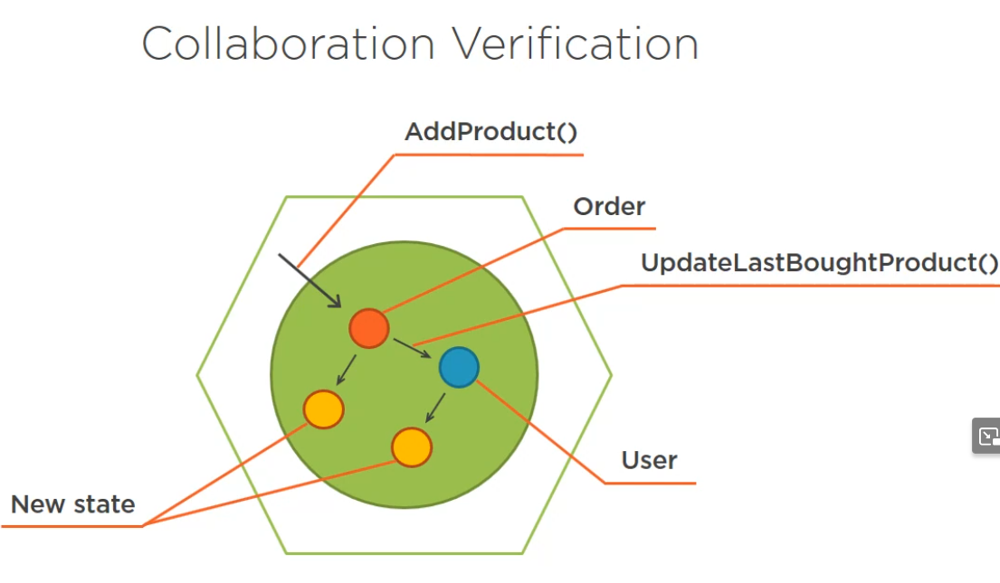
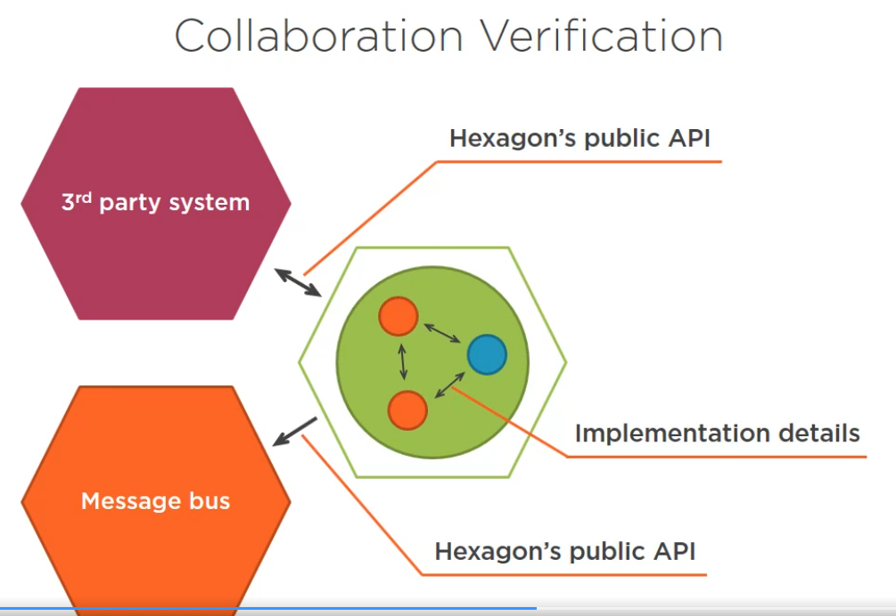
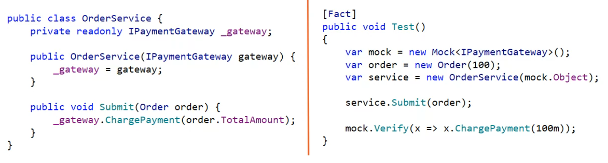

### Styles of Unit Testing
* output verification (functional)
* state verification
* collaboration verification

### Hexagonal Architecture



### What is Implementation Detail?

Addresses an immediate goal of the client code and addresses that goal completely.
```C#
public class User 
{
    public string Name { get; set; }
    // Normalize name is implementation detail 
    // and should be handled by the class itself
    public string NormalizeName(string name)
    {
        string result = (name ?? "").Trim();

        return (result.Length > 50)
            ? result.Substring(0, 50) : result;
    }
}

// ==>
public class User 
{
    private string _name;

    public string Name 
    { 
        get => _name;
        set => _name = NormalizeName(value);
    }

    private string NormalizeName(string name)
    {
        string result = (name ?? "").Trim();

        return (result.Length > 50)
            ? result.Substring(0, 50) : result;
    }
}

public class UserController 
{
    public void ChangeName(int userId, string newName)
    {
        User user = GetUserFromDb(userId);
        User.Name = newName;
    }
}
```

```C#
void GetProduct(int id)
{
    Order order = GetOrderFromDB(id);
    // ! exposing implementation detail
    Product product = order.Products.SingleOrDefault(x => x.PartNumber == "M0312");
    return product;
}

void GetProduct(int id)
{
    Order order = GetOrderFromDB(id);
    // keeping details encapsulated
    Product product = order.GetProduct("M0312");
    return product;
}
```

### Functional
Test are carried out providing input value and verifying output.

Best protection against false positives.

Easy to maintain.

Participants:

```C#
// Immutable - input variable - 
double Calculate(double x, double y)
{
    return x * x + y * y;
}
```
```c#
// Mutable - Collaborator -
double Calculate(ICalculator calculator, double x, double y)
{
    calculator.Push(x);
    calculator.Push(y);
    return calculator.CalculateFormula();
}
```

### State verification
Has input or instigator and SUT is expected to change state of an object that is part of the public API.



### Collaboration Verification
Can be internal or external. In order to be part of the public API it has to be called by an outside layer.

Internal communication (inside the hexagon) is usually implementation detail and verifying against it is more likely to produce false positives and maintainablity is poor.

As a guideline you should verify collaborations at the very edges of your system.


We can see in the diagram that both of the classes `Order` and `User` transition to a new state and can be observed and verified.

External communication (outside the hexagon) is part of communication state.

Wrap external services with your own gateways.
Commision the communication with other hexagons - to application services.




### Black-box vs. White-box Testing

Black-box testing is testing without knowing the internal structure.

White-box testing is testing the internal structure.